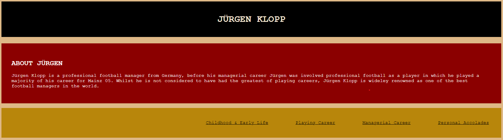

# [HISTORY OF KLOPPO](https://gyamfi98.github.io/history-of-kloppo)

The History of Kloppo is made to target fans of football and sport alike. The visitors of History of Kloppo would football fans, fans of Jürgen Klopp or fans of one of the clubs that he managed during his time as a manager, even fans of the German national team and German football are the target for this site as Klopp is especially loved in his home country. This site doesn't specifically target a single age group but on a wider basis targets all age groups able to access the internet simultaneously. If you're researching Jürgen Klopp for a school project this website would be ideal, or if it's a fan of Klopp's potential club who would like to research more on him to look at what they could be preparing for.  

The goal of this site are for me to present accurate and reliable information about a key figure of modern football in a tasteful manner that keeps the readers engaged in the information. I aim to provide photos detailing Jürgen Klopp's journey along the way so you are not only reading and following the timeline but they also have visual keys to help them see what Klopp has been through during his life.

## UX

At the beginning of my creation of the History of Kloppo page I did quick sketches of what I wanted the page to resemble and how I could make the page as easily navigatable as possible for the experience of the user. 
After I had the rough sketches for what I wanted the site to look like, I then went on to see what features had to be present in the design of the page and what features made the page harder to understand or operate so I could lose whatever would provide my users with a negative experience. 
After the layouts and features of my page had started to take structure, I went on to decide how I would present my information in a way that it would be easy to track and not daunting by being overloaded with information.
When a majority of my content hadd been added and finalised I then went on to make final decisions on what the final page should look like, i.e background colors, image positions, text fonts and sizes that would make the sit look easier on the eye to the potential users. 

### Colour Scheme

For my color scheme I wanted to immediately show the link to Klopp from the moment that the user first enters the History of Kloppo.
To do this I thought it would be a good idea to make the header, introduction and the nav bar into a color scheme of the German flag. 
Since Klopp is extremely well known is his country of origin as well as worldwide, it seemed like a good way to bring a little bit of Klopp to this page. 

For the color of the text in History of Kloppo I used '000000' throughtout as it makes the text a lot easier to read since majority of the page is on a light background 'B8860B'
For the header and the informatioon section I used 'FFFFFF' to create a contrast against the black and red backgrounds as this would have not made it possible for the reader to see or would have made it very difficult at least.

### Typography

- [Courier New] was used as the base font for all text on the History of Kloppo because it has a modern style to it that would appeal to users, certain parts of texts have more emphasis to show their order of importance

## Features

### Existing Features

- **Header** 
- The header is completely blacked out with the white font color to draw attention to the main part of the page .

- **Navigation**
-The navigation bar sets out what different sections of the page there are so the user immediately knows what content to expect.
-The links in the navigation bar take the user to each relevant section so they don't need to scroll down and get confused.
-The navigation hover code helps the links standout to the other text with the interactive engagement. 

- **Footer**
-The footer also contains a link to Klopp's instagram account which invites the user to not only see the History of Klopp but invites them to keep up to date with Klopp now and see him from a more informal setting that they may not have envisioned before. 

- **Form**
-The footer section has a form that invites the user to type in their email and full name - this would allow them to send a message to Jurgen Klopp and makes History of Kloppo feel more personal. It's beneficial that the user can see it no matter where they are on the page, this means they'll always be able to send the message without having to scroll to the bottom.  

### Future Features

- Photo Gallery
    - A future feature I feel could be beneficial for the History of Klopp is a photo gallery, where the extensive imagees of Klopp can sit in collected section, leaving more space for other interactions in the home page
- Video popups
    - Another feature I would look to implement on the site is video pop ups from interactions on certain parts of the page. I feel like this would engage the visitors and increase the engagement of the History of Kloppo

-  This was used to create the README and TESTING template so that I could use to help me create my own version
-  used to add commits and comments (`git add`, `git commit`, `git push`)
-  used for secure online code storage.
-  used as a cloud-based IDE for development.
-  used for the main site content.
-  used to style the design and layout

## Testing

> [!NOTE]  
> For all testing, please refer to the [TESTING.md](TESTING.md) file.

## Deployment

The site was deployed to GitHub Pages. The steps to deploy are as follows:

- In the [GitHub repository](https://github.com/Gyamfi98/history-of-kloppo), navigate to the Settings tab 
- From the source section drop-down menu, select the **Main** Branch, then click "Save".
- The page will be automatically refreshed with a detailed ribbon display to indicate the successful deployment.

The live link can be found [here](https://gyamfi98.github.io/history-of-kloppo)

## Credits

### Content

| Source | Location | Notes |
| --- | --- | --- |
| [Markdown Builder](https://tim.2bn.dev/markdown-builder) | README and TESTING | tool to help generate the Markdown files |
| [Wikipedia](https://en.wikipedia.org/wiki/J%C3%BCrgen_Klopp) | entire site | Information about Jurgen Klopp throught his life |
| [BBC Sport](https://www.bbc.co.uk/sport/football/51989229.amp) | entire site | Information about Jurgen Klopp in his youth and as a footballer |
| [Liverpool ECHO](https://www.liverpoolecho.co.uk/sport/football/football-news/liverpool-news-documentary-klopp-father-19273670) | entire site | Information about Klopp and his father |
| [TheFamousPeopole](https://www.thefamouspeople.com/profiles/jrgen-klopp-14996.php) | entire site | Information about Klopp |
| [CodeInstitute](https://learn.codeinstitute.net/courses/course-v1:CodeInstitute+IDE101+4/courseware/facc8621a8ae417385f8575ffb86868b/b0e234171d894b60939681eaafbf613c/) | navigation bar | how to make an interactive nav bar |
| [CodeInstitute](https://learn.codeinstitute.net/courses/course-v1:CodeInstitute+LRR101+2/courseware/9645be8635124d76b35692f1f1f6b753/2c4f82a9ef174830aa83ff2cf10f4bc7/) | footer | make footer stick to bottom of page |
| [CodeInstitute](https://learn.codeinstitute.net/courses/course-v1:CodeInstitute+HE101+2/courseware/fcc67a894619420399970ae84fc4802f/05a72bc3e032457d8a3d108d33656c72/) | form | form validation |
| [StackOverflow](https://stackoverflow.com/a/2450976) | quiz page | Fisher-Yates/Knuth shuffle in JS |
| [YouTube](https://www.youtube.com/watch?v=YL1F4dCUlLc) | leaderboard | using `localStorage()` in JS for high scores |
| [YouTube](https://www.youtube.com/watch?v=u51Zjlnui4Y) | PP3 terminal | tutorial for adding color to the Python terminal |
| [strftime](https://strftime.org) | CRUD functionality | helpful tool to format date/time from string |
| [WhiteNoise](http://whitenoise.evans.io) | entire site | hosting static files on Heroku temporarily |

### Media

| Source | Location | Type | Notes |
| --- | --- | --- | --- |
| [siamliverpool.club](https://d3j2s6hdd6a7rg.cloudfront.net/v2/uploads/media/default/0002/05/83ec1bf029860d9d2800a1b87e8c8909b046ebd8.jpeg) | home page | image | childhood photos |
| [siamliverpool.club](https://d3j2s6hdd6a7rg.cloudfront.net/v2/uploads/media/default/0002/05/thumb_104701_default_news_size_5.jpeg) | home page | image | adult Klopp |
| [siamliverpool.club](https://d3j2s6hdd6a7rg.cloudfront.net/v2/uploads/media/default/0002/05/58da41ae3e6bf03b699f814abc5caa9fc80c671c.jpeg) | home page | image | adult Klopp |
| [Pinterest](https://i.pinimg.com/originals/42/5e/6e/425e6ee79d75df40319079c42864a763.jpg) | home page | image | Baby Klopp |
| [BBC Sport](https://ichef.bbci.co.uk/ace/ws/624/cpsprodpb/E3D8/production/_111382385_1.topbodypic.copyrightingorath.jpg.webp) | home page | image | childhood Klopp |
| [BBC Sport](https://ichef.bbci.co.uk/ace/ws/624/cpsprodpb/2470/production/_111382390_2.copyrightingorath.jpg.webp) | home page | image | childhood Klopp |
| [BBC Sport](https://ichef.bbci.co.uk/news/1024/cpsprodpb/0D21/production/_111416330_jurenklopppromoingorath.png) | home page | image | childhood Klopp |
| [Chat GPT](https://chatgpt.com/) | home page | image | ai generated image of Klopp |
| [Ocuriosodofutebol](https://blogger.googleusercontent.com/img/b/R29vZ2xl/AVvXsEin8_ed9qkDiZIGuy3aEXVCz4iykEjq0rrkwpxu1yC_b5OgTXWHf1GZ3CSAzItQSDIxoh5C-uCai3yFT8ftZiCJGEneia_yo9iMxYP0VXWo3kC2I_e37eWtJuOx5s275_suJHPj4x2Fnpc/w640-h336/ffc0adc5-4d34-4424-9c81-ef3147a32669.jpg) | home page | image | Klopp playing for mainz |
| [Late Tackle Magazine](https://www.latetacklemagazine.com/wp-content/uploads/2015/12/klopp.jpg) | home page | image | Klopp playing for mainz |
| [Sky Sports](https://e0.365dm.com/16/11/1600x900/skysports-jurgen-klopp-mainz-st-pauli_3830477.jpg?20161113101821) | home page | image | Klopp playing for mainz |
| [Uniminuto Radio](https://www.uniminutoradio.com.co/wp-content/uploads/2020/06/klopp-mainz.jpg) | home page | image | Klopp playing for mainz |
| [Sports Illustrated](https://www.si.com/.image/t_share/MTY4MDE2OTcwOTg4NTI5MDI0/mainz-05-v-vfb-stuttgart-5d28a3f068d6094d09000001jpg.jpg) | home page | image | Klopp managing mainz |
| [The Redmen TV](https://cdn.theredmentv.com/theredmentv.com/2018/06/16110010/Klopp-Mainz.jpg) | home page | image | Klopp managing mainz |
| [Sprout Wired](https://cdn.cnn.com/cnnnext/dam/assets/200624143729-jurgen-klopp-mainz-super-169.jpg) | home page | image | Klopp managing mainz |
| [Sky Sports](https://e0.365dm.com/19/05/1600x900/skysports-jurgen-klopp-dortmund_4657948.jpg?20190503175913) | home page | image | Klopp managing Dortmund |
| [SportsNet](https://www.sportsnet.ca/wp-content/uploads/2015/04/08406547.jpg) | home page | image | Klopp managing Dortmund |
| [Pinterest](https://i.pinimg.com/originals/d9/92/c4/d992c49f2d6432d3e89a1973bb98261a.jpg) | home page | image | Klopp managing Dortmund |
| [The Daily Telegraph](https://www.telegraph.co.uk/content/dam/football/2016/04/02/DortmundAFP_trans_NvBQzQNjv4BqpiVx42joSuAkZ0bE9ijUnGH28ZiNHzwg9svuZLxrn1U.jpg?imwidth=680) | home page | image | Klopp farewell ceremony |
| [Talksport](https://talksport.com/wp-content/uploads/sites/5/2019/01/GettyImages-144261383.jpg?strip=all&w=960&quality=100) | home page | image | Klopp managing Dortmund |
| [Independant](https://static.independent.co.uk/s3fs-public/thumbnails/image/2015/04/15/11/Jurgen-Klopp.jpg?quality=75&width=982&height=726&auto=webp) | home page | image | Klopp managing Dortmund |
| [SportsKeeda](https://statico.sportskeeda.com/editor/2018/10/d9cef-15393107881073-800.jpg) | home page | image | Klopp managing Liverpool |
| [Sporting News](https://library.sportingnews.com/styles/crop_style_16_9_desktop/s3/2022-05/jurgen-klopp-liverpool-champions-league-trophy.jpg?itok=JLE7U_GL) | home page | image | Klopp managing Liverpool |
| [Liverpool ECHO](https://i2-prod.liverpoolecho.co.uk/incoming/article17461043.ece/ALTERNATES/s615b/0_GettyImages-1195364700.jpg) | home page | image | Klopp managing Liverpool |
| [Torizone](https://static.netnaija.com/i/jyK68XmjawD.webp) | home page | image | Klopp managing Liverpool |
| [Goal](https://assets.goal.com/v3/assets/bltcc7a7ffd2fbf71f5/blt47a8adfd5d898ffd/621c8d7d9f6e557009a093c9/GettyImages-1373159821.jpg) | home page | image | Klopp managing Liverpool |
| [Insider](https://i.insider.com/628007d2e7446d0018cc877b?width=700) | home page | image | Klopp managing Liverpool |
### Acknowledgements

- I would like to acknowledge [Code Institute](https://learn.codeinstitute.net/) as the tutorials and templates helped me to format my documents and debugging code
- I would like to thank my Code Institute mentor, [Tim Nelson](https://github.com/TravelTimN) for the aid and assistance along the way with the project
- I would like to thank [Wikipedia](https://www.wikipedia.org/) for the vast information I was able to gather on Klopp using their site
